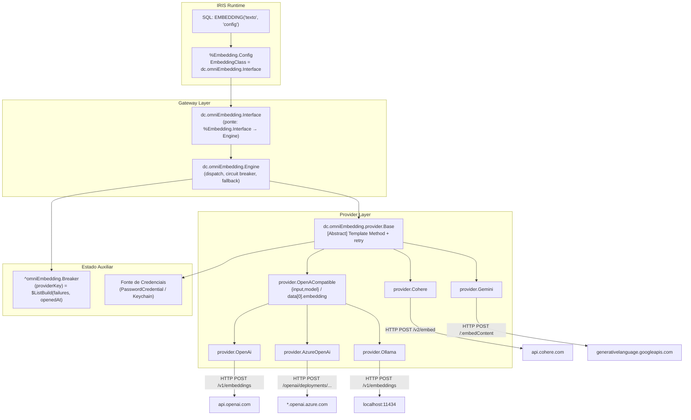
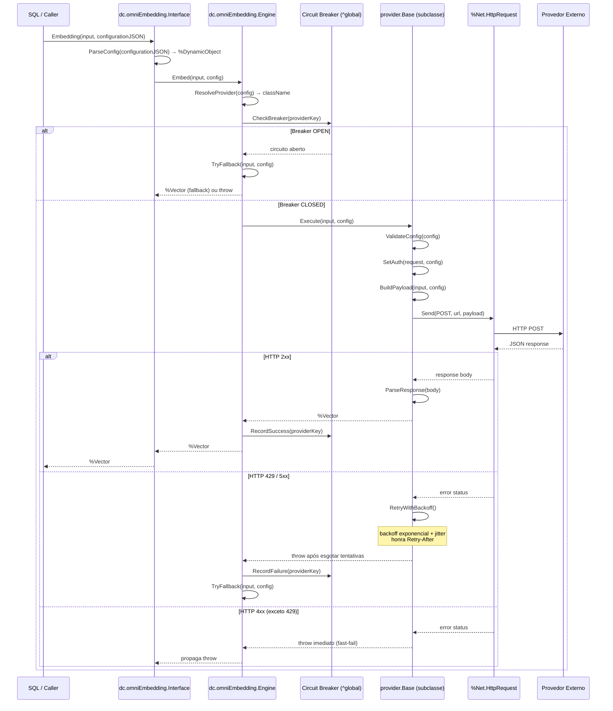
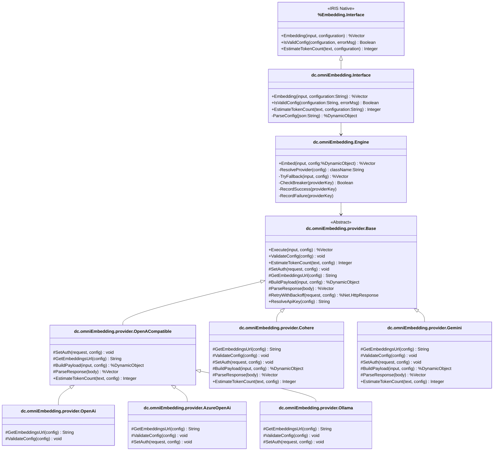
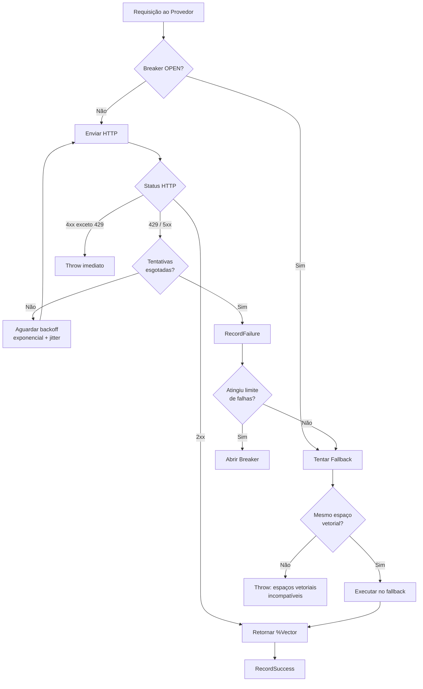

# Documento de Design: dc.omniEmbedding — Universal Embedding Gateway

## Overview

O `dc.omniEmbedding` é um gateway universal de embeddings para InterSystems IRIS. Ele se integra nativamente à infraestrutura de embeddings do IRIS via `%Embedding.Interface`, permitindo que qualquer provedor externo de modelos de linguagem (Ollama, OpenAI, Azure OpenAI, Cohere, Gemini) seja consumido de forma transparente por aplicações que já utilizam `EMBEDDING()` SQL ou a API de classes nativa.

O design segue três pilares inegociáveis: **HTTP nativo primeiro** (`%Net.HttpRequest` sem dependências Python no caminho principal), **polimorfismo por hierarquia de classes** (nenhum `if/switch` espalhado para determinar comportamento por provedor), e **integridade do espaço vetorial como invariante rígida** (vetores de modelos diferentes jamais coexistem na mesma coluna ou são misturados em fallback).

### Princípio 9 — Strict ObjectScript Naming Conventions (Constitution)

Identificadores ObjectScript (nomes de classes, métodos, parâmetros e propriedades) **exigem PascalCase ou camelCase**. O uso de underscores em nomes de métodos, classes ou propriedades é **terminantemente proibido**: o compilador IRIS interpreta `_` em nomes de métodos como operador de concatenação de strings, causando erros `<SYNTAX>` silenciosos e difíceis de depurar.

- **Classes:** `dc.omniEmbedding.provider.OpenACompatible` (ponto como separador de pacote, PascalCase por segmento)
- **Métodos:** `BuildPayload`, `ParseResponse`, `GetEmbeddingsUrl`, `EstimateTokenCount` — nunca `Build_Payload`
- **Parâmetros e variáveis locais:** camelCase — `providerKey`, `embeddingArray`, `apiBase`
- **Testes:** `TestBuildPayloadBasicShape`, `TestParseResponseMissingData` — nunca `Test_Build_Payload`

Esta regra aplica-se a **todo código** neste namespace, incluindo classes de teste, sem exceção.


---

## Architecture

### Arquitetura Geral



### Fluxo de Chamada Principal



### Provedores e Endpoints

| Provedor | Endpoint | Autenticação | Observação |
|----------|----------|--------------|------------|
| Ollama | `{apiBase}/v1/embeddings` | Nenhuma | CI local sem chave |
| OpenAI | `https://api.openai.com/v1/embeddings` | `Authorization: Bearer {key}` | |
| Azure OpenAI | `{apiBase}/openai/deployments/{deployment}/embeddings?api-version={ver}` | `api-key: {key}` | Aceita URL completa em `apiBase` |
| Cohere | `https://api.cohere.com/v2/embed` | `Authorization: Bearer {key}` | Parse aninhado `embeddings.float[0]` |
| Gemini | `https://generativelanguage.googleapis.com/v1beta/models/{model}:embedContent?key={key}` | Key na query string | `taskType: RETRIEVAL_DOCUMENT` |

---

## Components and Interfaces

### Hierarquia de Classes



### Assinaturas de Métodos

#### `dc.omniEmbedding.Interface`

```objectscript
/// Ponte entre %Embedding.Interface e o Engine interno.
/// Traduz configuration:String → %DynamicObject e gerencia throw → boolean.
Class dc.omniEmbedding.Interface Extends %Embedding.Interface
{

/// Retorna %Vector com dimensão = config.dimensions.
/// Throws ##class(%Exception.General) em qualquer falha.
ClassMethod Embedding(
    input As %String,
    configuration As %String = ""
) As %Vector [ Final ]

/// Valida o JSON de configuração sem efetuar chamada HTTP.
/// Retorna 0 e preenche errorMsg se inválida; 1 caso contrário.
ClassMethod IsValidConfig(
    configuration As %String,
    ByRef errorMsg As %String
) As %Boolean [ Final ]

/// Estimativa conservadora de tokens.
/// Delega ao provedor resolvido pela config.
ClassMethod EstimateTokenCount(
    text As %String,
    configuration As %String = ""
) As %Integer [ Final ]

/// Converte JSON string para %DynamicObject.
/// Throws se JSON mal formado.
ClassMethod ParseConfig(
    json As %String
) As %DynamicObject [ Private ]

}
```

#### `dc.omniEmbedding.Engine`

```objectscript
/// Responsável por: despacho ao provedor correto, circuit breaker e fallback.
Class dc.omniEmbedding.Engine
{

/// Ponto de entrada principal do Engine.
/// Throws em qualquer falha não recuperável.
ClassMethod Embed(
    input As %String,
    config As %DynamicObject
) As %Vector

/// Resolve o nome de classe ObjectScript do provedor.
/// Prioridade: config.provider explícito > inferência por prefixo de modelName.
ClassMethod ResolveProvider(
    config As %DynamicObject
) As %String [ Private ]

/// Executa o melhor fallback disponível, verificando invariância de espaço vetorial.
/// Throws se nenhum fallback for compatível.
ClassMethod TryFallback(
    input As %String,
    config As %DynamicObject
) As %Vector [ Private ]

/// Verifica se o circuito está aberto para providerKey.
/// Retorna 1 (aberto) ou 0 (fechado/half-open).
ClassMethod CheckBreaker(
    providerKey As %String
) As %Boolean [ Private ]

/// Registra sucesso: zera contador de falhas, fecha circuito se estava aberto.
ClassMethod RecordSuccess(providerKey As %String) [ Private ]

/// Registra falha: incrementa contador; abre circuito se limite atingido.
ClassMethod RecordFailure(providerKey As %String) [ Private ]

/// Gera chave única do provedor: provider + "|" + modelName + "|" + apiBase.
ClassMethod ProviderKey(config As %DynamicObject) As %String [ Private ]

}
```

#### `dc.omniEmbedding.provider.Base`

```objectscript
/// Classe base abstrata. Define Template Method Execute() e hooks sobrescrevíveis.
Class dc.omniEmbedding.provider.Base [ Abstract ]
{

/// Template Method principal. Não deve ser sobrescrito.
/// Sequência: ValidateConfig → SetAuth → GetEmbeddingsUrl → BuildPayload
///            → RetryWithBackoff → ParseResponse
ClassMethod Execute(
    input As %String,
    config As %DynamicObject
) As %Vector [ Final ]

/// Valida campos obrigatórios comuns (modelName).
/// Subclasses chamam ##super() e adicionam validações próprias.
ClassMethod ValidateConfig(config As %DynamicObject) [ Abstract ]

/// Estima tokens. Piso conservador: Floor(ByteLen(text)/4) + 1.
/// Subclasses podem sobrescrever com estratégia mais precisa.
ClassMethod EstimateTokenCount(
    text As %String,
    config As %DynamicObject
) As %Integer

/// Define cabeçalho de autenticação na requisição HTTP.
ClassMethod SetAuth(
    request As %Net.HttpRequest,
    config As %DynamicObject
) [ Abstract ]

/// Retorna a URL completa do endpoint de embeddings.
ClassMethod GetEmbeddingsUrl(config As %DynamicObject) As %String [ Abstract ]

/// Monta o corpo JSON da requisição.
ClassMethod BuildPayload(
    input As %String,
    config As %DynamicObject
) As %DynamicObject [ Abstract ]

/// Interpreta a resposta HTTP e extrai o %Vector.
/// Throws se a resposta não contiver embedding válido.
ClassMethod ParseResponse(body As %DynamicObject) As %Vector [ Abstract ]

/// Executa a requisição HTTP com retry + backoff exponencial + jitter.
/// Honra cabeçalho Retry-After quando config.retry.honorRetryAfter = true.
/// Throws após esgotar tentativas.
ClassMethod RetryWithBackoff(
    request As %Net.HttpRequest,
    url As %String,
    config As %DynamicObject
) As %Net.HttpResponse [ Private, Final ]

/// Resolve a API key. Em produção lê de PasswordCredential pelo nome em config.apiKey.
/// Nunca retorna string vazia para provedores que exigem chave.
ClassMethod ResolveApiKey(config As %DynamicObject) As %String

}
```

#### `dc.omniEmbedding.provider.OpenACompatible`

```objectscript
/// Família de provedores com API compatível com OpenAI.
/// Payload: {input, model}. Parse: data[0].embedding.
Class dc.omniEmbedding.provider.OpenACompatible Extends dc.omniEmbedding.provider.Base [ Abstract ]
{

ClassMethod SetAuth(request As %Net.HttpRequest, config As %DynamicObject)
/// Adiciona: Authorization: Bearer {ResolveApiKey(config)}

ClassMethod BuildPayload(input As %String, config As %DynamicObject) As %DynamicObject
/// Retorna: { "input": input, "model": config.modelName }

ClassMethod ParseResponse(body As %DynamicObject) As %Vector
/// Extrai: body.data[0].embedding → %Vector

ClassMethod EstimateTokenCount(text As %String, config As %DynamicObject) As %Integer
/// Usa tiktoken (Embedded Python) se disponível, cacheado por modelo.
/// Fallback ao piso da Base se tiktoken indisponível.

}
```

#### Provedores Concretos

```objectscript
// ─── OpenAI ───────────────────────────────────────────────────────────────────
Class dc.omniEmbedding.provider.OpenAi Extends dc.omniEmbedding.provider.OpenACompatible
{
    ClassMethod GetEmbeddingsUrl(config) As %String
    /// Retorna: "https://api.openai.com/v1/embeddings"

    ClassMethod ValidateConfig(config)
    /// ##super() + assert: modelName não vazio, apiKey não vazio
}

// ─── Azure OpenAI ─────────────────────────────────────────────────────────────
Class dc.omniEmbedding.provider.AzureOpenAi Extends dc.omniEmbedding.provider.OpenACompatible
{
    ClassMethod GetEmbeddingsUrl(config) As %String
    /// Compõe URL: se config.apiBase já termina em "/embeddings", usa diretamente.
    /// Caso contrário: {apiBase}/openai/deployments/{deployment}/embeddings?api-version={apiVersion}
    /// Throws se deployment ou apiVersion ausentes.

    ClassMethod SetAuth(request As %Net.HttpRequest, config As %DynamicObject)
    /// Adiciona: api-key: {ResolveApiKey(config)}

    ClassMethod ValidateConfig(config)
    /// ##super() + assert: apiBase, deployment, apiVersion não vazios
}

// ─── Ollama ───────────────────────────────────────────────────────────────────
Class dc.omniEmbedding.provider.Ollama Extends dc.omniEmbedding.provider.OpenACompatible
{
    ClassMethod GetEmbeddingsUrl(config) As %String
    /// Retorna: "{config.apiBase}/v1/embeddings"
    /// Default apiBase = "http://localhost:11434" se ausente

    ClassMethod SetAuth(request As %Net.HttpRequest, config As %DynamicObject)
    /// No-op: Ollama não requer autenticação

    ClassMethod ValidateConfig(config)
    /// ##super() sem apiKey + assert: modelName não vazio, apiBase resolvível
}

// ─── Cohere ───────────────────────────────────────────────────────────────────
Class dc.omniEmbedding.provider.Cohere Extends dc.omniEmbedding.provider.Base
{
    ClassMethod GetEmbeddingsUrl(config) As %String
    /// Retorna: "https://api.cohere.com/v2/embed"

    ClassMethod SetAuth(request As %Net.HttpRequest, config As %DynamicObject)
    /// Adiciona: Authorization: Bearer {ResolveApiKey(config)}

    ClassMethod BuildPayload(input As %String, config As %DynamicObject) As %DynamicObject
    /// Retorna: { "texts": [input], "model": config.modelName,
    ///            "input_type": config.inputType ?? "search_document",
    ///            "embedding_types": ["float"] }

    ClassMethod ParseResponse(body As %DynamicObject) As %Vector
    /// Extrai: body.embeddings.float[0] → %Vector (parse aninhado duplo)

    ClassMethod ValidateConfig(config)
    /// ##super() + assert: apiKey não vazio

    ClassMethod EstimateTokenCount(text As %String, config As %DynamicObject) As %Integer
    /// Estratégia própria: Floor(ByteLen(text)/3.5) + 1 (tokens Cohere ~3.5 bytes/token)
}

// ─── Gemini ───────────────────────────────────────────────────────────────────
Class dc.omniEmbedding.provider.Gemini Extends dc.omniEmbedding.provider.Base
{
    ClassMethod GetEmbeddingsUrl(config) As %String
    /// Retorna: "https://generativelanguage.googleapis.com/v1beta/models/"
    ///          _ config.modelName _ ":embedContent?key=" _ ResolveApiKey(config)

    ClassMethod SetAuth(request As %Net.HttpRequest, config As %DynamicObject)
    /// No-op: autenticação já embutida na URL pela GetEmbeddingsUrl

    ClassMethod BuildPayload(input As %String, config As %DynamicObject) As %DynamicObject
    /// Retorna: { "content": { "parts": [{ "text": input }] },
    ///            "taskType": "RETRIEVAL_DOCUMENT" }

    ClassMethod ParseResponse(body As %DynamicObject) As %Vector
    /// Extrai: body.embedding.values → %Vector

    ClassMethod ValidateConfig(config)
    /// ##super() + assert: apiKey não vazio

    ClassMethod EstimateTokenCount(text As %String, config As %DynamicObject) As %Integer
    /// Estratégia Gemini: Floor(ByteLen(text)/4) + 2 (margem ligeiramente maior)
}
```

---

## Data Models

### Schema de Configuração (campo `Configuration` da `%Embedding.Config`)

```json
{
  "provider": "ollama | openai | azure | cohere | gemini",
  "modelName": "nomic-embed-text",
  "apiBase": "http://localhost:11434",
  "apiKey": "<credentialName-ou-vazio-para-Ollama>",
  "apiVersion": "2024-02-15-preview",
  "deployment": "emb-3-large",
  "inputType": "search_document",
  "dimensions": 1024,
  "sslConfig": "Default",
  "httpTimeout": 30,
  "checkTokenCount": false,
  "maxTokens": 8191,
  "retry": {
    "maxAttempts": 3,
    "baseDelayMs": 500,
    "maxDelayMs": 8000,
    "honorRetryAfter": true
  },
  "fallbacks": ["azure-emb-large-eastus2"]
}
```

**Campos obrigatórios por provedor:**

| Campo | ollama | openai | azure | cohere | gemini |
|-------|--------|--------|-------|--------|--------|
| `modelName` | ✓ | ✓ | ✓ | ✓ | ✓ |
| `apiBase` | ✓ | — | ✓ | — | — |
| `apiKey` | — | ✓ | ✓ | ✓ | ✓ |
| `deployment` | — | — | ✓ | — | — |
| `apiVersion` | — | — | ✓ | — | — |

### Estado do Circuit Breaker (Global)

```
^omniEmbedding.Breaker(providerKey) = $ListBuild(consecutiveFailures, openedAtSeconds)
```

- `providerKey`: identificador único do provedor, derivado de `provider + modelName + apiBase`
- `consecutiveFailures`: contador de falhas consecutivas; zero após sucesso
- `openedAtSeconds`: timestamp `$zts` do momento em que o circuito abriu; zero quando fechado

---

## Error Handling

### Diagrama de Resiliência



### Cenários de Erro

| Cenário | Condição | Resposta | Recuperação |
|---------|----------|----------|-------------|
| HTTP 429 | Rate limit atingido | Retry com backoff exponencial + jitter; honra `Retry-After` | Retentar até `maxAttempts`; se esgotado, `RecordFailure` e tentar fallback |
| HTTP 5xx | Erro transitório do servidor | Retry com backoff exponencial | Mesma lógica do 429 |
| HTTP 4xx (exceto 429) | Erro permanente (config, auth) | Throw imediato (`fast-fail`) | Não tenta novamente; propaga exceção ao caller |
| Circuit breaker OPEN | N falhas consecutivas atingidas | Bypass do provedor primário | `TryFallback`; após cooldown (60s), permite tentativa `half-open` |
| Fallback incompatível | `modelName` ou `dimensions` diferentes | Throw com mensagem explícita | Nunca executa fallback silencioso com espaço vetorial distinto |
| Todos os fallbacks esgotados | Nenhum fallback funcionou | Throw com lista de tentativas | Caller deve tratar e reportar |
| JSON malformado | Resposta inválida do provedor | Throw em `ParseResponse` | Fast-fail; conta como falha para o breaker |
| Credencial ausente | `apiKey` não resolvível | Throw em `ResolveApiKey` | Fast-fail; não conta como falha de rede |

---

## Testing Strategy

### Testes Unitários

- Validação de config por provedor (campos obrigatórios, formatos)
- Parse de resposta JSON por provedor (incluindo parse aninhado Cohere)
- Construção de URL Azure (raiz vs. URL completa)
- `EstimateTokenCount` por provedor e corner cases

### Testes de Integração (CI via Ollama local)

- Fluxo completo `EMBEDDING('texto', 'config')` → `%Vector` via Ollama sem chave
- Verificação de dimensão do vetor retornado
- Fallback entre duas configs Ollama do mesmo espaço vetorial
- Circuit breaker: abrir após N falhas simuladas, fechar após cooldown

### Testes de Propriedade

**Biblioteca**: InterSystems IRIS Unit Testing (`%UnitTest.TestCase`)

- `∀ input texto não vazio, config válida → Embedding() retorna %Vector de dimensão = config.dimensions`
- `∀ falha de rede → throw com mensagem acionável (nunca vetor vazio)`
- `∀ fallback config com modelName ou dimensions distintos → throw (nunca silencioso)`

### Testes de Performance (NFR)

- Latência P95 ≤ 200ms para Ollama local (sem rede externa)
- Overhead do gateway vs. chamada HTTP direta ≤ 5ms

---

## Correctness Properties

*Uma propriedade é uma característica ou comportamento que deve ser verdadeiro em todas as execuções válidas do sistema — essencialmente, uma declaração formal sobre o que o sistema deve fazer. As propriedades servem como ponte entre especificações legíveis por humanos e garantias de corretude verificáveis por máquina.*

### Property 1: Dimensão correta do vetor retornado

*Para qualquer* string de input não vazia e config válida com `dimensions = D`, a chamada `Embedding(input, config)` deve retornar um `%Vector` tal que `$VECTORLEN(resultado) = D`.

**Validates: Requirements 1.1, 16.2**

---

### Property 2: Rejeição de configuração inválida

*Para qualquer* provedor e qualquer combinação de campos obrigatórios ausentes, `IsValidConfig(configJSON, .errorMsg)` deve retornar `0` e `errorMsg` deve ser uma string não vazia que identifica o campo problemático. Adicionalmente, `Embedding()` com a mesma config deve lançar exceção e nunca retornar.

**Validates: Requirements 3.1, 3.2, 3.5**

---

### Property 3: Sem vetor vazio em falha

*Para qualquer* cenário de falha (erro de rede, HTTP error, JSON malformado, credencial ausente, fallback exaurido), o Gateway deve lançar exceção e NUNCA retornar um `%Vector` de dimensão zero ou nulo.

**Validates: Requirements 13.2, 13.5**

---

### Property 4: Invariância de espaço vetorial no fallback

*Para qualquer* par `(configPrimária, configFallback)` onde `configFallback.modelName ≠ configPrimária.modelName` OU `configFallback.dimensions ≠ configPrimária.dimensions`, `TryFallback()` deve lançar exceção identificando a incompatibilidade e NUNCA executar a chamada HTTP para o fallback incompatível.

**Validates: Requirements 12.2**

---

### Property 5: Fallback compatível é executado

*Para qualquer* par `(configPrimária, configFallback)` onde `configFallback.modelName = configPrimária.modelName` E `configFallback.dimensions = configPrimária.dimensions`, quando o Provider primário falha, `TryFallback()` deve executar a chamada ao Provider do fallback.

**Validates: Requirements 12.3**

---

### Property 6: Ollama aceita ausência de apiKey

*Para qualquer* config com `provider = "ollama"`, `modelName` válido e `apiKey` ausente ou vazio, `ValidateConfig()` deve concluir sem lançar exceção relacionada à ausência de `apiKey`, e `Execute()` deve enviar a requisição HTTP sem cabeçalho `Authorization`.

**Validates: Requirements 6.1, 6.2**

---

### Property 7: Construção de URL Ollama

*Para qualquer* `apiBase` fornecida (com ou sem trailing slash), `Ollama.GetEmbeddingsUrl` deve retornar `{apiBase}/v1/embeddings` sem barras duplicadas. Quando `apiBase` está ausente, deve usar `http://localhost:11434/v1/embeddings`.

**Validates: Requirements 6.3, 6.4**

---

### Property 8: Construção de URL Azure sem duplicação

*Para qualquer* combinação de `(apiBase, deployment, apiVersion)` — seja `apiBase` uma raiz ou URL completa com ou sem trailing slash — `AzureOpenAi.GetEmbeddingsUrl` deve retornar uma URL válida que contenha exatamente uma ocorrência de `/openai/deployments/` e termine com `?api-version={apiVersion}`.

**Validates: Requirements 5.1, 5.2, 5.5**

---

### Property 9: Payload OpenAI-compatible

*Para qualquer* par `(input, modelName)`, `OpenACompatible.BuildPayload` deve retornar um `%DynamicObject` com exatamente os campos `input` e `model` com os valores corretos correspondentes.

**Validates: Requirements 4.1**

---

### Property 10: Parse de resposta — rejeição de formato inesperado

*Para qualquer* objeto JSON de resposta que não contenha o campo de embedding esperado pelo provedor (`data[0].embedding` para OpenACompatible, `embeddings.float[0]` para Cohere, `embedding.values` para Gemini), `ParseResponse` deve lançar exceção contendo o corpo da resposta para diagnóstico.

**Validates: Requirements 4.3, 7.4, 8.5, 13.3**

---

### Property 11: Retry honra Retry-After e limites de backoff

*Para qualquer* N inteiro positivo no cabeçalho `Retry-After` com `config.retry.honorRetryAfter = true`, o delay calculado pelo `RetryWithBackoff` deve ser `≥ N × 1000 ms`. *Para qualquer* combinação de `(attempt, baseDelayMs, maxDelayMs)` sem `Retry-After`, o delay deve ser `≤ maxDelayMs`.

**Validates: Requirements 10.2, 10.3**

---

### Property 12: Fast-fail em erros 4xx (exceto 429)

*Para qualquer* status HTTP 4xx diferente de 429, `RetryWithBackoff` deve lançar exceção imediatamente na primeira tentativa, sem executar nenhuma retentativa.

**Validates: Requirements 10.4**

---

### Property 13: Circuit breaker — abertura por limiar de falhas

*Para qualquer* `providerKey`, após exatamente 5 falhas consecutivas registradas via `RecordFailure`, `CheckBreaker` deve retornar `1` (aberto) para qualquer timestamp dentro dos próximos 60 segundos, e retornar `0` para qualquer timestamp após 60 segundos do momento de abertura.

**Validates: Requirements 11.2, 11.3, 11.4**

---

### Property 14: Circuit breaker — reset por sucesso

*Para qualquer* `providerKey` com circuito em qualquer estado (aberto ou fechado), após `RecordSuccess`, `CheckBreaker` deve retornar `0` e o global `^omniEmbedding.Breaker(providerKey)` deve ser `$ListBuild(0, 0)`.

**Validates: Requirements 11.5**

---

### Property 15: Segurança de credencial — ausência de valor em exceções

*Para qualquer* nome de credencial não encontrada em `PasswordCredential`, `ResolveApiKey` deve lançar exceção que contém o nome da credencial mas NÃO contém o valor dela (que é desconhecido neste cenário, por definição).

**Validates: Requirements 13.4, 14.3**

---

## Low-Level Design — Algoritmos com Especificações Formais

### Template Method — `Base.Execute`

```pascal
ALGORITHM Base.Execute(input, config)
INPUT:  input  : String (texto a ser embeddado)
        config : %DynamicObject (configuração do provedor já parseada)
OUTPUT: vector : %Vector (vetor de dimensão = config.dimensions)

PRECONDITIONS:
  - input ≠ ""
  - config ≠null AND config.modelName ≠ ""
  - Esta instância é uma subclasse concreta (não Abstract)

POSTCONDITIONS:
  - RETORNA %Vector de dimensão = config.dimensions
  - SE qualquer erro → throw %Exception.General com mensagem acionável
  - NUNCA retorna vetor vazio ou nulo

BEGIN
  // Passo 1: Validação
  CALL ValidateConfig(config)
  // throws se inválida (postcondição: ou passa ou lança)

  // Passo 2: Preparar requisição HTTP
  request ← NEW %Net.HttpRequest
  SET request.ContentType = "application/json"
  SET request.Timeout     = config.httpTimeout ?? 30

  IF config.sslConfig ≠ "" THEN
    SET request.SSLConfiguration = config.sslConfig
  END IF

  // Passo 3: Autenticação (hook polimórfico)
  CALL SetAuth(request, config)

  // Passo 4: URL e payload (hooks polimórficos)
  url     ← GetEmbeddingsUrl(config)
  payload ← BuildPayload(input, config)
  CALL request.SetBody(payload.%ToJSON())

  // Passo 5: Execução com retry
  response ← RetryWithBackoff(request, url, config)
  // throws após esgotar tentativas

  // Passo 6: Parse da resposta
  body   ← ##class(%DynamicObject).%FromJSON(response.Data)
  vector ← ParseResponse(body)
  // throws se body não contém embedding válido

  ASSERT $VECTORLEN(vector) = config.dimensions

  RETURN vector
END
```

**Invariante de Loop** (não há loop neste método; o loop de retry está em `RetryWithBackoff`)

---

### Algoritmo de Retry com Backoff Exponencial

```pascal
ALGORITHM RetryWithBackoff(request, url, config)
INPUT:  request : %Net.HttpRequest
        url     : String
        config  : %DynamicObject
OUTPUT: response : %Net.HttpResponse

PRECONDITIONS:
  - request ≠ null, url ≠ ""
  - config.retry.maxAttempts ≥ 1
  - config.retry.baseDelayMs > 0
  - config.retry.maxDelayMs ≥ config.retry.baseDelayMs

POSTCONDITIONS:
  - RETORNA %Net.HttpResponse com status 2xx
  - SE todas as tentativas falharem → throw com último erro registrado

BEGIN
  maxAttempts  ← config.retry.maxAttempts  ?? 3
  baseDelayMs  ← config.retry.baseDelayMs  ?? 500
  maxDelayMs   ← config.retry.maxDelayMs   ?? 8000
  honorRetryAfter ← config.retry.honorRetryAfter ?? 1
  attempt      ← 0

  WHILE attempt < maxAttempts DO
    // Invariante: 0 ≤ attempt < maxAttempts
    // Invariante: todas as tentativas anteriores retornaram 429 ou 5xx

    attempt ← attempt + 1

    TRY
      response ← request.Post(url)
      status   ← response.StatusCode

      IF status >= 200 AND status < 300 THEN
        RETURN response  // sucesso
      ELSE IF status = 429 OR (status >= 500 AND status < 600) THEN
        // Transitório: pode tentar novamente
        IF attempt = maxAttempts THEN
          throw "Max retry attempts (" _ maxAttempts _ ") exceeded. Last status: " _ status
        END IF

        // Calcular delay
        IF honorRetryAfter AND response.GetHeader("Retry-After") ≠ "" THEN
          delayMs ← response.GetHeader("Retry-After") * 1000
        ELSE
          // Backoff exponencial: baseDelay * 2^(attempt-1) + jitter[0, baseDelay)
          delayMs ← MIN(baseDelayMs * (2 ^ (attempt - 1)) + RAND(baseDelayMs), maxDelayMs)
        END IF

        SLEEP(delayMs)
      ELSE
        // 4xx (exceto 429): falha permanente, não tentar novamente
        throw "HTTP " _ status _ ": " _ response.StatusLine _ " — URL: " _ url
      END IF
    CATCH ex
      IF attempt = maxAttempts THEN
        throw "Network error after " _ maxAttempts _ " attempts: " _ ex.DisplayString()
      END IF
      delayMs ← MIN(baseDelayMs * (2 ^ (attempt - 1)) + RAND(baseDelayMs), maxDelayMs)
      SLEEP(delayMs)
    END TRY
  END WHILE
END
```

**Invariante do Loop:**
- `attempt ≤ maxAttempts` em toda iteração
- Todas as `attempt - 1` iterações anteriores resultaram em 429 ou 5xx
- `delayMs ≤ maxDelayMs` em todo ponto de espera

---

### Algoritmo do Circuit Breaker

```pascal
ALGORITHM Engine.CheckBreaker(providerKey)
INPUT:  providerKey : String
OUTPUT: isOpen : Boolean (1 = aberto/bloqueado, 0 = fechado/liberado)

CONSTANTS:
  FAILURE_THRESHOLD = 5       // falhas consecutivas para abrir
  COOLDOWN_SECONDS  = 60      // tempo para tentar half-open

BEGIN
  breaker ← $GET(^omniEmbedding.Breaker(providerKey))

  IF breaker = "" THEN
    RETURN 0  // sem histórico = fechado
  END IF

  failures  ← $LIST(breaker, 1)
  openedAt  ← $LIST(breaker, 2)

  IF failures < FAILURE_THRESHOLD THEN
    RETURN 0  // abaixo do limiar = fechado
  END IF

  // Circuito aberto: verificar cooldown
  elapsedSeconds ← $zts - openedAt

  IF elapsedSeconds >= COOLDOWN_SECONDS THEN
    RETURN 0  // cooldown expirado = half-open (permitir uma tentativa)
  ELSE
    RETURN 1  // ainda dentro do cooldown = aberto
  END IF
END

ALGORITHM Engine.RecordFailure(providerKey)
BEGIN
  breaker  ← $GET(^omniEmbedding.Breaker(providerKey))
  failures ← $SELECT(breaker="": 0, 1: $LIST(breaker, 1))
  failures ← failures + 1

  IF failures >= FAILURE_THRESHOLD THEN
    openedAt ← $zts
  ELSE
    openedAt ← $SELECT(breaker="": 0, 1: $LIST(breaker, 2))
  END IF

  SET ^omniEmbedding.Breaker(providerKey) = $LISTBUILD(failures, openedAt)
END

ALGORITHM Engine.RecordSuccess(providerKey)
BEGIN
  // Zera contador; fecha circuito (se estava open/half-open)
  SET ^omniEmbedding.Breaker(providerKey) = $LISTBUILD(0, 0)
END
```

---

### Algoritmo de Resolução de Provedor

```pascal
ALGORITHM Engine.ResolveProvider(config)
INPUT:  config : %DynamicObject
OUTPUT: className : String (nome completo da classe ObjectScript do provedor)

PRECONDITIONS:
  - config ≠ null
  - config.modelName ≠ "" OR config.provider ≠ ""

POSTCONDITIONS:
  - RETORNA nome de classe válido e instanciável
  - SE provider não reconhecido → throw com mensagem acionável

BEGIN
  // Prioridade 1: provider explícito na config
  provider ← config.provider

  IF provider ≠ "" THEN
    MATCH provider
      CASE "ollama"  : RETURN "dc.omniEmbedding.provider.Ollama"
      CASE "openai"  : RETURN "dc.omniEmbedding.provider.OpenAi"
      CASE "azure"   : RETURN "dc.omniEmbedding.provider.AzureOpenAi"
      CASE "cohere"  : RETURN "dc.omniEmbedding.provider.Cohere"
      CASE "gemini"  : RETURN "dc.omniEmbedding.provider.Gemini"
      DEFAULT        : throw "Unknown provider: '" _ provider _ "'. Valid: ollama, openai, azure, cohere, gemini"
    END MATCH
  END IF

  // Prioridade 2: inferência por prefixo de modelName
  model ← $ZCONVERT(config.modelName, "L")  // lowercase

  IF $FIND(model, "nomic-") OR $FIND(model, "mxbai-") OR $FIND(model, "llama") THEN
    RETURN "dc.omniEmbedding.provider.Ollama"
  ELSE IF $FIND(model, "text-embedding-") AND $FIND(model, "ada") THEN
    RETURN "dc.omniEmbedding.provider.OpenAi"
  ELSE IF $FIND(model, "text-embedding-3") THEN
    RETURN "dc.omniEmbedding.provider.OpenAi"
  ELSE IF $FIND(model, "embed-") THEN
    RETURN "dc.omniEmbedding.provider.Cohere"
  ELSE IF $FIND(model, "embedding-") THEN
    RETURN "dc.omniEmbedding.provider.Gemini"
  ELSE
    throw "Cannot infer provider from modelName '" _ config.modelName _ "'. Set config.provider explicitly."
  END IF
END
```

---

### Algoritmo de Validação de Fallback (Invariância de Espaço Vetorial)

```pascal
ALGORITHM Engine.TryFallback(input, config)
INPUT:  input  : String
        config : %DynamicObject (config primária que falhou)
OUTPUT: vector : %Vector

PRECONDITIONS:
  - config.fallbacks ≠ null AND config.fallbacks.%Size() > 0
  - config.modelName e config.dimensions são conhecidos

POSTCONDITIONS:
  - RETORNA %Vector de mesmo espaço vetorial que a config primária
  - SE nenhum fallback compatível → throw com razão explícita
  - NUNCA mistura vetores de espaços vetoriais distintos

BEGIN
  fallbackList ← config.fallbacks   // Array de nomes de %Embedding.Config

  FOR i = 0 TO fallbackList.%Size() - 1 DO
    // Invariante: todos os fallbacks anteriores foram rejeitados ou falharam
    fallbackName ← fallbackList.%Get(i)
    fbConfig ← LoadEmbeddingConfig(fallbackName)  // lê %Embedding.Config pelo nome

    IF fbConfig = null THEN
      // Config não encontrada: logar aviso, continuar para próximo
      CONTINUE
    END IF

    fbParsed ← ParseConfig(fbConfig.Configuration)

    // INVARIANTE CRÍTICA: verificar compatibilidade de espaço vetorial
    IF fbParsed.modelName ≠ config.modelName OR fbParsed.dimensions ≠ config.dimensions THEN
      throw "Fallback '" _ fallbackName _ "' has incompatible vector space: "
            _ "model=" _ fbParsed.modelName _ " dims=" _ fbParsed.dimensions
            _ " (primary: model=" _ config.modelName _ " dims=" _ config.dimensions _ ")"
    END IF

    // Espaço vetorial compatível: tentar
    TRY
      vector ← Embed(input, fbParsed)
      RETURN vector
    CATCH ex
      // Este fallback também falhou: tentar o próximo
      CONTINUE
    END TRY
  END FOR

  // Nenhum fallback funcionou
  throw "All fallbacks exhausted for provider '" _ config.provider _ "' with model '" _ config.modelName _ "'"
END
```

---

### Algoritmo de Construção de URL Azure

```pascal
ALGORITHM AzureOpenAi.GetEmbeddingsUrl(config)
INPUT:  config : %DynamicObject
OUTPUT: url : String

PRECONDITIONS:
  - config.apiBase ≠ ""
  - config.deployment ≠ ""
  - config.apiVersion ≠ ""

POSTCONDITIONS:
  - RETORNA URL válida terminando em "?api-version={apiVersion}"
  - Não duplica segmentos de path

BEGIN
  base ← config.apiBase

  // Remover trailing slash
  IF $EXTRACT(base, $LENGTH(base)) = "/" THEN
    base ← $EXTRACT(base, 1, $LENGTH(base) - 1)
  END IF

  // Verificar se apiBase já é URL completa (contém "/openai/deployments/")
  IF $FIND(base, "/openai/deployments/") > 0 THEN
    // Assumir URL completa; apenas adicionar api-version se ausente
    IF $FIND(base, "api-version=") = 0 THEN
      RETURN base _ "?api-version=" _ config.apiVersion
    ELSE
      RETURN base
    END IF
  END IF

  // Compor URL padrão
  RETURN base
    _ "/openai/deployments/" _ config.deployment
    _ "/embeddings"
    _ "?api-version=" _ config.apiVersion
END
```

---

## Plano de Implementação por Fases

| Fase | Classes a criar/modificar | Requisitos cobertos |
|------|--------------------------|---------------------|
| **0 — Fundação** | `Interface`, `Engine` (stub), `Base` (ValidateConfig + EstimateTokenCount piso), `ResolveApiKey` stub | FR-01, FR-03 |
| **1 — Ollama CI** | `OpenACompatible`, `Ollama` | FR-06, FR-04 |
| **2 — OpenAI/Azure** | `OpenAi`, `AzureOpenAi` (URL robusta) | FR-04, FR-05 |
| **3 — Cohere** | `Cohere` (parse aninhado, inputType) | FR-07 |
| **4 — Gemini** | `Gemini` (auth na query, taskType) | FR-08 |
| **5 — Resiliência** | `RetryWithBackoff` (Base), circuit breaker (Engine) | FR-10, FR-11 |
| **6 — Fallback** | `TryFallback` com invariância de espaço vetorial | FR-12 |
| **7 — Endurecimento** | `ResolveApiKey` real, tiktoken cacheado (`OpenACompatible`), `IsValidConfig` completo | FR-09, FR-13 |

---

## Dependencies

| Dependência | Tipo | Obrigatoriedade | Observação |
|-------------|------|-----------------|------------|
| `%Embedding.Interface` | IRIS nativa | Obrigatória | Base da ponte |
| `%Net.HttpRequest` | IRIS nativa | Obrigatória | Transporte principal (ADR-001) |
| `%DynamicObject` | IRIS nativa | Obrigatória | Parse JSON |
| `%SYS.Credential` / `PasswordCredential` | IRIS nativa | Obrigatória (prod) | Resolução de API keys (ADR-006) |
| `tiktoken` (Python) | Embedded Python | Opcional | `EstimateTokenCount` preciso em `OpenACompatible`; fallback ao piso se indisponível |
| Ollama (local) | Serviço externo | CI | Testes de integração sem chave (ADR-001, ADR-008) |

---

## Decisões de Design Registradas (ADRs)

| ADR | Decisão | Justificativa |
|-----|---------|---------------|
| ADR-001 | `%Net.HttpRequest` como transporte primário | Sem dependência Python no caminho feliz; Embedded Python só como fallback de cauda longa |
| ADR-002 | Classe-ponte `Interface` estende `%Embedding.Interface` | Integração zero-config com SQL `EMBEDDING()` e `%Embedding.Config` |
| ADR-003 | Template Method em `Base.Execute` + família `OpenACompatible` | Elimina `if/switch` espalhado; comportamento por provedor via override |
| ADR-004 | `ValidateConfig` com `##super()` em cadeia | Validação comum na base + específica por provedor, sem duplicação |
| ADR-005 | Escopo: 5 provedores de embedding (Ollama, OpenAI, Azure, Cohere, Gemini) | Azure Kimi é chat-only, fora do escopo de embeddings |
| ADR-006 | `apiKey` referencia nome de credencial, nunca valor direto | Segredo nunca no dado; resolvido em runtime |
| ADR-007 | `inputType` Cohere via config, default `search_document` | Quem precisar de `search_query` cria config dedicada sem alterar código |
| ADR-008 | `EstimateTokenCount` polimórfico com piso conservador | CI sem dependência Python; produção pode usar tiktoken cacheado |
| ADR-009 | Retry com backoff + circuit breaker via global | Duas camadas de resiliência; circuit breaker cross-process via `^global` |
| ADR-010 | Fallback só entre réplicas do mesmo espaço vetorial | Integridade vetorial é sagrada; incompatível rejeitado explicitamente |

---

## Expansão v1.1+ — Novos Providers

Esta seção documenta os providers adicionados após a v1.0. Nenhum altera Interface, Engine (exceto ramos de `ResolveProvider`), Base, `RetryWithBackoff` ou `TryFallback`. Cada novo provider entra como uma subclasse pura seguindo o Template Method existente.

### Diagrama atualizado

```mermaid
graph TD
    ENGINE["dc.omniEmbedding.Engine"]
    BASE["dc.omniEmbedding.provider.Base [Abstract]"]
    OAC["provider.OpenACompatible [Abstract]"]
    SIGV4["util.SigV4 (helper)"]

    ENGINE --> BASE
    BASE --> OAC
    BASE --> COHERE["Cohere"]
    BASE --> GEMINI["Gemini"]
    BASE --> BEDROCK["Bedrock (v1.1)"]
    OAC --> OPENAI["OpenAi"]
    OAC --> AZURE["AzureOpenAi"]
    OAC --> OLLAMA["Ollama"]
    OAC --> MISTRAL["Mistral (v1.0.4)"]
    OAC --> VOYAGE["Voyage (v1.1)"]
    OAC --> JINA["Jina (v1.1)"]
    BEDROCK -.usa.-> SIGV4

    OPENAI -->|POST /v1/embeddings| EXT_OPENAI["api.openai.com"]
    AZURE -->|POST /openai/deployments/...| EXT_AZURE["*.openai.azure.com"]
    OLLAMA -->|POST /v1/embeddings| EXT_OLLAMA["localhost:11434"]
    COHERE -->|POST /v2/embed| EXT_COHERE["api.cohere.com"]
    GEMINI -->|POST /:embedContent| EXT_GEMINI["generativelanguage.googleapis.com"]
    MISTRAL -->|POST /v1/embeddings| EXT_MISTRAL["api.mistral.ai"]
    VOYAGE -->|POST /v1/embeddings| EXT_VOYAGE["api.voyageai.com"]
    JINA -->|POST /v1/embeddings| EXT_JINA["api.jina.ai"]
    BEDROCK -->|POST /model/&#123;id&#125;/invoke SigV4| EXT_BEDROCK["bedrock-runtime.&#123;region&#125;.amazonaws.com"]
```



### Matriz de comportamento por provider

| Provider | Herda | URL | Payload distinto | Auth | Parse |
|---|---|---|---|---|---|
| Ollama | OpenACompatible | `apiBase or localhost:11434` + `/v1/embeddings` | (herdado) | **no-op** | (herdado) |
| OpenAi | OpenACompatible | constante `api.openai.com/v1/embeddings` | (herdado) | Bearer | (herdado) |
| AzureOpenAi | OpenACompatible | composta com `deployment` + `apiVersion` | (herdado) | `api-key` header | (herdado) |
| Mistral | OpenACompatible | constante | + `output_dimension`, `output_dtype` | Bearer | (herdado) |
| Voyage | OpenACompatible | constante | + `input_type`, `truncation`, `output_dimension`, `output_dtype` | Bearer | (herdado) |
| Jina | OpenACompatible | constante | `input` como **array**, + `task`, `dimensions`, `late_chunking`, `embedding_type` | Bearer | (herdado) |
| Cohere | Base | constante `v2/embed` | `texts[]`, `input_type`, `embedding_types` | Bearer | `embeddings.float[0]` (aninhado) |
| Gemini | Base | com `?key=` (auth na URL) | `content.parts[0].text` | **no-op** (na URL) | `embedding.values` |
| Bedrock | Base | por region + modelId | por família (Titan / Cohere via Bedrock) | **SigV4** | por família (Titan `.embedding` / Cohere-via-BR `.embeddings[0]`) |

### Contrato de `outputDimension` e `outputDtype` (padronização cross-provider)

Cada provider tem seu nome nativo para "truncar server-side" e "tipo de saída". No config do gateway padronizamos em **camelCase**:

| Config field | Mistral | Voyage | Jina |
|---|---|---|---|
| `outputDimension` | `output_dimension` | `output_dimension` | `dimensions` |
| `outputDtype` | `output_dtype` | `output_dtype` | `embedding_type` |

Essa mediação é responsabilidade de cada Provider (feita em `BuildPayload`) — o Caller escreve sempre o mesmo campo.

### Decisão: Bedrock sem inferência por prefixo

O `modelId` `cohere.embed-english-v3` colide semanticamente com um modelo Cohere direto que também poderia se chamar `cohere.embed-*`. Para evitar despacho ambíguo, **Bedrock exige `provider = "bedrock"` explícito**. A tabela de prefixos permanece inequívoca: `nomic-` / `mxbai-` / `*llama*` → Ollama; `text-embedding-` → OpenAI; `embed-` → Cohere; `embedding-` → Gemini; `mistral-` / `codestral-` → Mistral; `voyage-` → Voyage; `jina-` → Jina.

### ADRs adicionados

| ID | Decisão | Justificativa |
|---|---|---|
| ADR-011 | Mistral, Voyage, Jina estendem `OpenACompatible` | Payload e resposta compartilhados evitam duplicação; apenas passthroughs opcionais em `BuildPayload` |
| ADR-012 | Jina envia `input` sempre como array de 1 elemento | Contrato da API Jina — variação pequena e absorvida em `BuildPayload` |
| ADR-013 | `outputDimension` / `outputDtype` padronizados em camelCase no config | Caller escreve uma vez, cada Provider mapeia para seu nome nativo — reduz vazamento de detalhe de vendor no domínio |
| ADR-014 | Bedrock exige `provider = "bedrock"` explícito (sem inferência por prefixo) | Prefixo `cohere.embed-*` colide com Cohere direto; ambiguidade eliminada por design |
| ADR-015 | SigV4 isolado em `util.SigV4` — não em `Base` nem em `Bedrock` | Único caso hoje que precisa; isolamento mantém `Base.RetryWithBackoff` e Providers OpenAI-family sem contaminação; testável independentemente contra os vetores oficiais da AWS |
| ADR-016 | Credencial Bedrock resolvida como `accessKeyId:secretAccessKey` (ou JSON) sob nome único | Reusa `Ens.Config.Credentials` sem introduzir um segundo store; `sessionToken` (temporário) fica em segundo nome opcional |
